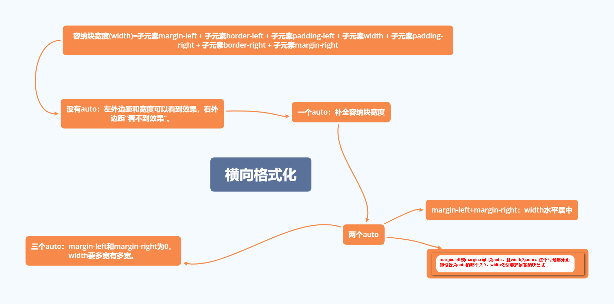

#### 外边折叠

* 情况一： 盒子的底部margin和下一个兄弟的顶部margin，会产生外边距折叠。

  块状元素的上、下外边距会折叠。折叠的时候谁大用谁。

  解决方法：设置第一个元素`display:inline-block`或直接设置某一边的`margin`。

* 情况二：父盒子和子盒子之间的margin。

  

  产生的原因：margin之间直接接触了，没有阻隔。

  解决方法：父元素设置边框、内边距。或者父元素设置`overflow:hidden;`

  浏览器产生折叠的原因：就是为了页面排版美观。


#### 行内元素的外边距

* 行内元素上设置上、下外边距对行高没有影响。
* 行内元素上设置左、右外边距对内容是有影响的。
* 行内块状元素的上、下、左、右外边距都可以正常使用。


#### 横向格式化



* 默认情况下普通文档块级框各个组成的横向尺寸始终等于容纳块的宽度。

  容纳块：离的最近的块级元素。

  容纳块宽度=子元素的margin-left + 子元素的border-left + 子元素的padding-left + 子元素的width + 子元素的padding-right + 子元素的border-right + 子元素的margin-right

  上面的7个属性中只有子元素的width、子元素的margin-left、子元素的margin-right可以设置为auto。其他的属性只能设置具体指或使用默认值（默认值为0）

* 情况一：width、margin-left、margin-right，其中两个设置为具体指，一个为auto。

  这种情况下设置为auto的值的那个属性必须满足上面所说的公式，auto理解为补全总和所缺的尺寸。

  ```html
  <!DOCTYPE html>
  <html>

  <head>
      <title></title>
      <style>
          body{
              margin:0;
          }
          #f{
              width:300px;
              height:300px;
              border:1px solid green;
          }

          #z{
              /* 300 - 100 - 10 -2  */
              width:100px;
              height:100px;
              margin-left:10px;
              margin-right: auto;

              border:1px solid blue;
          }
      </style>
  </head>

  <body>
      <div id="f">
          <div id="z"></div>
      </div>
  </body>

  </html>
  ```

  width、margin-left、margin-right，其中margin-left和margin-right都设置为具体的值，width的值为auto，这种情况下auto的值也需要满足上面所说的公式，宽度会被自动拉开。

  ```html
  <!DOCTYPE html>
  <html>

  <head>
      <title></title>
      <style>
          body {
              margin: 0;
          }

          #f {
              width: 300px;
              height: 300px;
              border: 1px solid green;
          }

          #z {

              width: auto;
              height: 100px;
              margin-left: 10px;
              margin-right: 20px;

              border: 1px solid blue;
          }
      </style>
  </head>

  <body>
      <div id="f">
          <div id="z"></div>
      </div>
  </body>

  </html>
  ```

* 情况二：width、margin-left、margin-right其中两个为auto。

  * 如果margin-left和margin-right都为auto，那么两个外边距相等，元素在父元素中间显示。

    ```html
    <!DOCTYPE html>
    <html>

    <head>
        <title></title>
        <style>
            body {
                margin: 0;
            }

            #f {
                width: 300px;
                height: 300px;
                border: 1px solid green;
            }

            #z {
                /*
                
                (300-100-1-1 ) / 2
                */
                width:100px;
                height: 100px;
                margin-left: auto;
                margin-right: auto;

                border: 1px solid blue;
            }
        </style>
    </head>

    <body>
        <div id="f">
            <div id="z"></div>
        </div>
    </body>

    </html>
    ```

  * 将某一外边距和width设置为auto时。外边距为auto的那个值等于0。width被设置为填满容纳块所需要的值。

    ```html
    <!DOCTYPE html>
    <html>

    <head>
        <title></title>
        <style>
            body {
                margin: 0;
            }

            #f {
                width: 300px;
                height: 300px;
                border: 1px solid green;
            }

            #z {
                width:auto;
                height: 100px;
                margin-left: auto;
                margin-right: 10px;

                border: 1px solid blue;
            }
        </style>
    </head>

    <body>
        <div id="f">
            <div id="z"></div>
        </div>
    </body>

    </html>
    ```

* 情况三：如果三个属性都设置为auto，那么两边的外边距为0，width要多宽有多宽。

  ```html
  <!DOCTYPE html>
  <html>

  <head>
      <title></title>
      <style>
          body {
              margin: 0;
          }

          #f {
              width: 300px;
              height: 300px;
              border: 1px solid green;
          }

          #z {
              width:auto;
              height: 100px;
              margin-left: auto;
              margin-right: auto;

              border: 1px solid blue;
          }
      </style>
  </head>

  <body>
      <div id="f">
          <div id="z"></div>
      </div>
  </body>

  </html>
  ```

* 情况四：width、margin-left、margin-right，三个都设置为具体的值。这种情况叫过渡约束。这种情况下margin-right右边距看不到效果（右边没有其他内容）

  ```html
  <!DOCTYPE html>
  <html>

  <head>
      <title></title>
      <style>
          body {
              margin: 0;
          }

          #f {
              width: 300px;
              height: 300px;
              border: 1px solid green;
          }

          #z {
              width:100px;
              height: 100px;
              margin-left: 10px;
              margin-right: 20px;

              border: 1px solid blue;
          }
      </style>
  </head>

  <body>
      <div id="f">
          <div id="z"></div>
      </div>
  </body>

  </html>
  ```

#### 纵向格式化

块状元素的内容决定元素的默认高度。

容纳块高度公式：容纳块高度（height） = 子元素margin-top + 子元素border-top + 子元素padding-top + 子元素height + 子元素padding-bottom + 子元素border-bottom + 子元素margin-bottom

height和上、下外边距可以设置为auto。

* 块级框的margin-top或margin-bottom设置为auto时，自动计算为0。

  ```html
  <!DOCTYPE html>
  <html>

  <head>
      <title></title>
      <style>
          body {
              margin: 0;
          }

          #f {
              width: 300px;
              height: 300px;
              border: 1px solid green;
          }

          #z {
              width:100px;
              height: 100px;

              margin-top:auto;
              margin-bottom:auto;

              border: 1px solid blue;
          }
      </style>
  </head>

  <body>
      <div id="f">
          <div id="z"></div>
      </div>
  </body>

  </html>
  ```

* 块级框的margin-top、margin-bottom、都设置为具体的值，height的值为auto，高度不会被自动拉开。

  ```html
  <!DOCTYPE html>
  <html>

  <head>
      <title></title>
      <style>
          body {
              margin: 0;
          }

          #f {
              width: 300px;
              height: 300px;
              border: 1px solid green;
          }

          #z {
              width:100px;
              height: auto;

              margin-top:10px;
              margin-bottom:10px;

              border: 1px solid blue;
          }
      </style>
  </head>

  <body>
      <div id="f">
          <div id="z"></div>
      </div>
  </body>

  </html>
  ```

* 某一边和height为auto时，为auto的那边外边距等于0。height被设置为内容高度。

  ```html
  <!DOCTYPE html>
  <html>

  <head>
      <title></title>
      <style>
          body {
              margin: 0;
          }

          #f {
              width: 300px;
              height: 300px;
              border: 1px solid green;
          }

          #z {
              width:100px;
              height: auto;

              margin-top:auto;
              margin-bottom:10px;

              border: 1px solid blue;
          }
      </style>
  </head>

  <body>
      <div id="f">
          <div id="z">1234</div>
      </div>
  </body>

  </html>
  ```

* height、margin-top、margin-bottom都设置为具体的值。

  ```html
  <!DOCTYPE html>
  <html>

  <head>
      <title></title>
      <style>
          body {
              margin: 0;
          }

          #f {
              width: 300px;
              height: 300px;
              border: 1px solid green;
          }

          #z {
              width:100px;
              height: 100px;

              margin-top:100px;
              margin-bottom:10px;

              border: 1px solid blue;
          }
      </style>
  </head>

  <body>
      <div id="f">
          <div id="z"></div>
          <span>1111</span>
      </div>
  </body>

  </html>
  ```

#### 调整宽度和高度的计算方式

默认情况下，块级框的宽度等于内容区的宽度，高度等于内容区的高度。我们可以使用`box-sizing`来进行调整。

格式： `box-sizing:value`

* content-box，默认值，内容区域宽等于width，高等于height，内边距和边框都在这个尺寸的基础上进行增加。(w3c盒子模型的计算方式)
* border-box，宽度、高度等于内容区+内边距+边框，相应的内容区将会被缩小。（IE盒子模型，怪异盒子模型）

#### 背景

#### 列表

#### 表格

